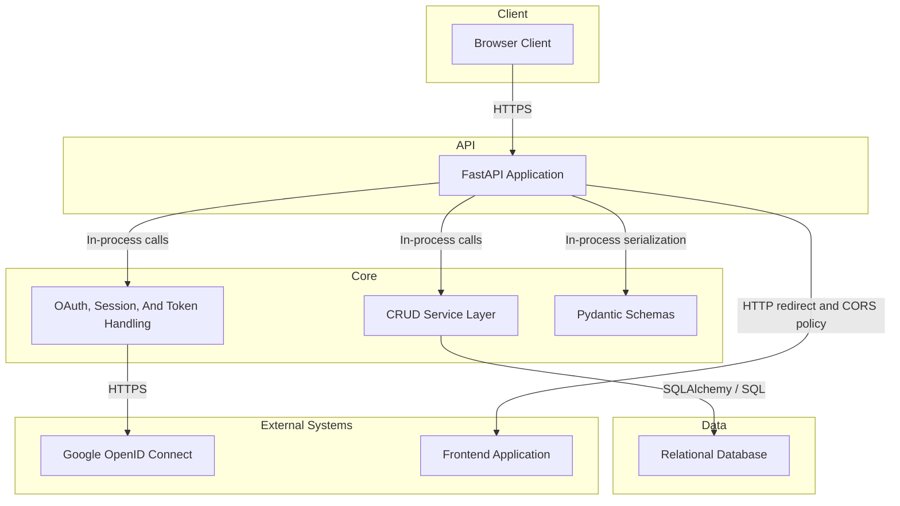

# High-Level Design — hackbca-example-backend

## Title & Metadata

- Repository: `nikithajoshy26/hackbca-example-backend`
- Repository type: FastAPI backend service
- Last updated: 2026-09-17
- Doc owner: Not determined from repository

## Executive Overview

- Provides a small FastAPI-based backend for HackBCA project and user management.
- Exposes REST endpoints for project listing, retrieval, creation, update, deletion, user listing, and current-user lookup.
- Uses Google OAuth to establish user identity, then issues an application login token stored in the database and returned via cookie or header.
- Persists application data with SQLAlchemy models backed by a relational database configured through `DATABASE_URL`.
- Keeps architecture intentionally compact: routing, dependency wiring, and middleware are in `main.py`; persistence logic is in `crud.py`; schema definitions are in `schemas.py`; ORM entities are in `models.py`.

## Objective

- Support a browser-based HackBCA experience that can:
  - authenticate users with Google,
  - persist users and project records,
  - authorize authenticated users to create projects,
  - authorize only associated users to update or delete a project,
  - return project and user data as JSON through FastAPI response models.
- Minimize backend complexity by using a single service process with in-process routing, authentication, and persistence layers.

## Architecture Description

- `main.py` owns the HTTP interface, dependency injection, middleware registration, and endpoint definitions.
- `auth.py` registers the Google OAuth client used by the login and callback routes.
- `crud.py`, `models.py`, and `database.py` provide the persistence boundary.
- The repository does not show a separate orchestration tier, message bus, cache, or background worker.

## Core Workflows

1. **Google sign-in**
   - Browser calls `GET /login/google`.
   - Backend stores an optional redirect target in the server-side session and redirects to Google.
   - Google returns to `GET /auth/google`.
   - Backend parses the Google ID token, upserts the user by Google subject, creates a login token record, and sets the token in a cookie before redirecting to the frontend URL.
2. **Authenticated project creation**
   - Client sends `POST /projects` with a token in the configured cookie or header.
   - Backend resolves the user from `login_tokens`.
   - Backend expands the supplied user UUID list to ORM user objects, appends the authenticated user ID when provided, persists a `projects` row plus join-table links, and returns the project payload.
3. **Project maintenance**
   - Client sends `PUT /projects/{uuid}` or `DELETE /projects/{uuid}`.
   - Backend loads the target project and verifies the authenticated user appears in the project's associated users.
   - Backend updates mutable project fields or deletes the project record.
4. **Read-only discovery**
   - Unauthenticated clients can call `GET /projects`, `GET /projects/{uuid}`, and `GET /users`.

## Data Flow

| Data | Source | Processing | Storage / Destination |
| --- | --- | --- | --- |
| Google identity claims | Google OAuth callback response | `oauth.google.authorize_access_token()` and `oauth.google.parse_id_token()` extract `sub` and `email` | `users` table via `crud.create_user()` when user does not already exist |
| Session redirect target | Query parameter on `GET /login/google` | Stored in `request.session["redirect"]` | Starlette session cookie, then consumed and deleted in `GET /auth/google` |
| Application login token | Generated by `models.LoginToken` UUID default during `crud.create_token()` | Looked up through cookie or header in `auth()` dependency | `login_tokens` table and response cookie |
| Project payload | JSON request body on `POST /projects` or `PUT /projects/{uuid}` | Pydantic validation in `ProjectIn`, user UUID resolution in `crud.unpack_project()` | `projects` table and `user_project_xref` join table |
| Read responses | ORM objects from SQLAlchemy queries | Serialized by FastAPI response models | JSON HTTP responses |

- Retention periods are not determined from repository.
- Encryption at rest is not determined from repository.

## Key Features

- Google OAuth login bootstrap with automatic user creation on first successful callback.
- Dual token transport for authenticated calls through either a cookie or header named by `TOKEN_NAME`.
- Project ownership model based on membership in the `users` relationship for update and delete authorization.
- ORM-backed many-to-many project collaboration model through `user_project_xref`.
- Automatic FastAPI schema serialization for user and project responses.
- Alembic migration scaffolding present for schema evolution.

## Infrastructure & Deployment Overview

- Runtime form: single Python web application process created by `FastAPI()`.
- Persistence: one relational database connection configured by `DATABASE_URL`.
- Session state: session middleware cookie signed with `SESSION_SECRET`.
- External identity dependency: Google OpenID Connect metadata endpoint and OAuth flow.
- Migrations: Alembic is configured with online and offline modes and references `Base.metadata`.
- Container packaging, infrastructure-as-code, and deployment manifests are not determined from repository.
- CI/CD workflow definitions are not present in the checked-in repository tree.

## Deployment Strategy

- Expected runtime configuration is environment-variable driven through `settings.py`.
- Database schema can be created in two ways visible in the repository:
  - application startup invokes `Base.metadata.create_all(bind=engine)`,
  - Alembic can run schema migrations using `alembic/env.py`.
- Frontend integration depends on setting `FRONTEND_URL` so redirects and CORS match the deployed client.
- Google login depends on configuring the Google client ID, client secret, and redirect URI.
- Blue/green, rolling, canary, and rollback strategies are not determined from repository.

## Data Protection

- **In transit**
  - Browser-to-backend protection is expected to rely on HTTP or HTTPS at deployment time; transport termination details are not determined from repository.
  - Backend-to-Google token exchange uses HTTPS through the Google OpenID Connect metadata endpoint.
- **At rest**
  - User, project, login-token, and join-table records are persisted in the configured relational database.
  - Database encryption at rest is not determined from repository.
- **Secrets handling**
  - OAuth credentials, database URL, session secret, and token name are sourced from environment variables.
  - The repository does not include a checked-in `.env.example` or other documented secret-distribution mechanism.
- **Cookies and tokens**
  - Application login tokens are persisted in the `login_tokens` table and are also returned as a cookie.
  - Token expiry, rotation, and revocation beyond explicit logout are not determined from repository.
- **Logging and retention**
  - Application-level request or audit logging is not determined from repository.
  - Data retention and deletion policies are not determined from repository.

## Security Requirements

- **Authentication**
  - Authenticated routes depend on a login token that maps to a `login_tokens` row.
  - The login token can arrive through either an API key cookie or API key header named by `TOKEN_NAME`.
  - User identities originate from Google ID token claims, specifically `sub` and `email`.
- **Authorization**
  - `POST /projects` requires an authenticated user.
  - `PUT /projects/{uuid}` and `DELETE /projects/{uuid}` require both authentication and membership in the target project's associated users.
  - `GET /projects`, `GET /projects/{uuid}`, and `GET /users` are unauthenticated in the current code.
- **Session and secret posture**
  - Session middleware uses `SESSION_SECRET`, which defaults to the literal string `secret` when the environment variable is unset.
  - Secret rotation, secret storage backend, and cookie hardening flags are not determined from repository.
- **Dependency posture**
  - The repository imports FastAPI, SQLAlchemy, Authlib, Starlette, Pydantic, and python-dotenv, but no dependency manifest is checked in to pin versions.
- **Threat considerations evident from code**
  - Login tokens are bearer credentials stored in the database without an expiration field in the model.
  - CORS configuration is driven by `FRONTEND_URL`; multi-origin policy support is not determined from repository.

## Integrations

| Integration | Purpose | Interaction | Authentication / Trust |
| --- | --- | --- | --- |
| Google OpenID Connect | User authentication and identity claims | `auth.py` registers Google OAuth client; `GET /login/google` and `GET /auth/google` execute the flow | OAuth client ID and client secret from environment variables |
| Relational database | Persist users, login tokens, projects, and project membership mappings | SQLAlchemy engine in `database.py`; CRUD operations in `crud.py`; Alembic migrations in `alembic/` | Credentials are expected inside `DATABASE_URL`; exact mechanism depends on deployment |
| Frontend application | Receive post-login redirects and define allowed browser origin | `FRONTEND_URL` is used for redirect targets and CORS middleware configuration | No backend-to-frontend credential exchange is shown in repository |

## Environment Variables & Secrets Inventory

| Name | Purpose |
| --- | --- |
| `DATABASE_URL` | Configures the SQLAlchemy and Alembic database connection |
| `GOOGLE_CLIENT_ID` | Supplies the Google OAuth client identifier |
| `GOOGLE_CLIENT_SECRET` | Supplies the Google OAuth client secret |
| `GOOGLE_REDIRECT_URI` | Supplies the Google OAuth callback URI |
| `FRONTEND_URL` | Sets the redirect base URL and CORS origin configuration |
| `SESSION_SECRET` | Signs session middleware data |
| `TOKEN_NAME` | Names the cookie and header used to carry the application login token |

## Change Log

- 2026-09-17: Initial repository-grounded HLD created from `main.py`, `crud.py`, `models.py`, `schemas.py`, `database.py`, `auth.py`, `settings.py`, and Alembic configuration files. Added all HLD sections because `docs/HLD.md` did not previously exist.
