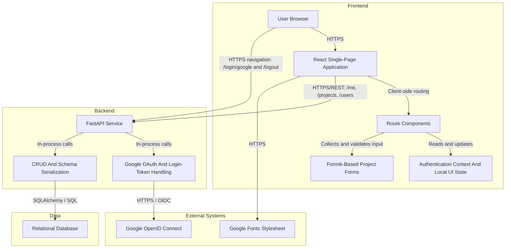

# High-Level Design — hackBCA Example System

## Title & Metadata

- Consolidation target repository: `nikithajoshy26/hackbca-example-backend`
- Document type: Consolidated high-level design
- Last updated: 2026-09-17
- Doc owner: Not determined from component docs
- Component repos merged:
  - Frontend — `nikithajoshy26/hackbca-example-frontend` (`docs/HLD.md` last updated 2026-09-17; `docs/LLD.md` last updated 2026-09-17)
  - Backend — `nikithajoshy26/hackbca-example-backend` (`docs/HLD.md` last updated 2026-09-17; `docs/LLD.md` last updated 2026-09-17)

## Executive Overview

- The hackBCA example system combines a React single-page application frontend with a FastAPI backend service to support project discovery, project details, and authenticated project maintenance.
- The frontend owns browser rendering, client-side routing, authenticated UI state, and project submission flows.
- The backend owns Google-backed sign-in, application login-token issuance, REST endpoints, authorization, and relational persistence for users and projects.
- End-to-end behavior centers on browser requests that either load public project data or complete authenticated flows that start in the frontend, pass through the backend, and persist state in the database.

## Objective

- Provide one coherent system that lets hackathon participants:
  - browse the landing page and project catalog,
  - inspect individual project details,
  - authenticate through a Google-backed backend login flow,
  - create, update, and delete projects when authenticated and authorized.
- Keep the frontend lightweight as a separately built React SPA while keeping the backend compact as a single FastAPI service responsible for authentication, CRUD operations, and persistence.

## Architecture Description

- The frontend and backend are independently scoped components, but they operate as a single user-facing system through browser-to-API HTTP interactions.
- Google sign-in is entered from the browser, processed by the backend, and then reflected back into frontend UI state through the authenticated `/me` request path.
- The backend provides the system's persistence and authorization boundary, while the frontend provides the navigation and form orchestration layer.

## Core Workflows

1. **Google sign-in, token issuance, and frontend session bootstrap**
   - A user starts from the browser UI and navigates to the backend login route.
   - The backend stores any redirect target, redirects the browser to Google, processes the callback, creates or reuses the user, creates a login token, and sets the token cookie before redirecting back to the frontend.
   - The frontend then requests `/me` with browser credentials and uses the response to populate its shared authentication context.
2. **Browse and inspect projects**
   - The frontend requests `GET /projects` to render the catalog and `GET /projects/{id}` to render project details.
   - The backend returns serialized project and user data from the relational store.
3. **Authenticated project creation and maintenance**
   - The frontend React project form loads the user directory, validates project form state locally, and submits project create or update requests to the backend.
   - The backend authenticates the request from the configured token cookie or header, resolves referenced users, persists the project and membership rows in the relational database, and returns the resulting payload.
   - For update and delete operations, the backend also verifies that the authenticated user is associated with the target project before mutating data.

## Data Flow

| Data | Frontend Role | Backend Role | Storage / Destination |
| --- | --- | --- | --- |
| Current user state | Requests `GET /me` with browser credentials and stores the response in shared UI state | Resolves the login token to a user and returns the authenticated user payload | Browser memory for UI state; `login_tokens` and `users` tables as the source of truth |
| Project collection and project details | Requests `GET /projects` and `GET /projects/{id}` and renders the returned records | Queries and serializes project and user relationships | JSON HTTP responses backed by `projects`, `users`, and join-table records |
| User directory | Requests `GET /users` to populate owner-selection controls | Lists persisted users for project-association choices | JSON HTTP response backed by the `users` table |
| Project mutation payloads | Collects form input, converts date and time values to ISO strings, and submits create or update requests | Validates the request shape, resolves user UUIDs, appends the authenticated user when provided, and persists project changes | `projects` table plus `user_project_xref` join-table rows |
| Google identity claims | Receives the post-login redirect outcome indirectly through browser navigation and later `/me` state refresh | Exchanges the callback for Google claims, upserts the user, and creates the application login token | `users` table, `login_tokens` table, and response cookie |
| Session redirect target | Initiates login with an optional redirect path | Stores and later consumes the redirect value during the Google login round trip | Session cookie managed by the backend |

- The frontend docs do not show a persistent client-side storage layer; browser memory is the directly observed frontend storage location.
- Database retention, token expiration, and encryption-at-rest details are not determined from the component docs.

## Key Features

### Frontend

- Client-side routing for home, list, detail, create, edit, and fallback routes.
- Shared authentication context that adapts navigation, sign-in prompts, and owner-only controls.
- Project listing, detail, and modal-based deletion flows.
- Project create and update forms with local validation, dynamic owner selection, and payload shaping.
- Tailwind-based branding and styling.

### Backend

- Google OAuth login bootstrap with automatic user creation on first successful callback.
- Application login-token issuance accepted from either the configured cookie or header.
- Project CRUD endpoints with authorization tied to project membership.
- ORM-backed many-to-many collaboration model for projects and users.
- FastAPI schema serialization and Alembic-backed schema-evolution scaffolding.

## Infrastructure & Deployment Overview

### Frontend

- Built and developed through CRACO-wrapped Create React App commands.
- Produces static assets for deployment behind a static web server.
- Depends on a backend API base URL selected by `REACT_APP_API_URL` or a localhost default.

### Backend

- Runs as a single FastAPI web application process.
- Persists state through one relational database connection configured by `DATABASE_URL`.
- Uses session middleware signed with `SESSION_SECRET` and external Google OpenID Connect for login.
- Includes Alembic migration wiring in addition to runtime schema creation.

### End-to-end system view

- The frontend and backend are deployed as separate components that must agree on the backend base URL, redirect URL, and browser-origin policy.
- The system also depends on Google for sign-in and on a relational database for persistent application state.
- Container packaging, infrastructure-as-code, TLS termination location, and repository-defined CI workflow files are not determined from the component docs.

## Deployment Strategy

- Build and release the frontend as static assets, injecting the backend base URL through `REACT_APP_API_URL` at build time when needed.
- Deploy the backend with environment-variable-driven configuration for database access, Google OAuth, frontend redirects, session signing, and token naming.
- Configure production hosting so the frontend serves deep links back to the SPA entry point and the backend allows the deployed frontend origin for redirects and CORS.
- The backend docs show two schema-management paths: runtime `create_all` behavior and Alembic migrations.
- Blue/green, rolling, canary, CDN, rollback, and release-orchestration details are not determined from the component docs.

## Data Protection

- **In transit**
  - The frontend communicates with the backend over HTTP APIs and authenticated browser requests; both component docs indicate production deployments should prefer HTTPS.
  - The backend communicates with Google OpenID Connect over HTTPS during login flows.
  - The frontend also loads a Google Fonts stylesheet over HTTPS.
- **At rest**
  - The frontend docs identify browser memory as the directly observed client-side storage location and do not show Local Storage, IndexedDB, or service-worker caching.
  - The backend persists users, login tokens, projects, and project memberships in a relational database.
  - Encryption at rest is not determined from the component docs.
- **Secrets and sensitive configuration**
  - The frontend uses `REACT_APP_API_URL` as configuration rather than a secret.
  - The backend relies on environment-provided database and OAuth settings plus a session secret.
- **Cookies and tokens**
  - Authenticated frontend requests depend on browser credentials being included.
  - The backend issues and stores application login tokens and uses them to resolve authenticated users.
  - Token expiry, rotation, revocation beyond logout, and cookie-lifetime details are not determined from the component docs.
- **Retention and logging**
  - The frontend docs mention optional web-vitals reporting only when a callback is supplied.
  - Application logging, audit logging, and data-retention policies are not determined from the component docs.

## Security Requirements

- The backend is the source of truth for authentication and authorization, while the frontend performs presentation-layer checks only.
- The end-to-end authenticated path requires the browser to retain backend-issued credentials so the frontend can call `/me`, project mutations, and user-listing endpoints with credentials included.
- Google identity claims originate from the backend's Google OAuth flow; the backend creates or reuses the user record and issues the application login token that the frontend later relies on.
- Project creation requires an authenticated user, and project update or delete requires both authentication and project association checks in the backend.
- Production deployments should require HTTPS for frontend-to-backend traffic to protect cookies and API requests.
- The backend docs note that `SESSION_SECRET` defaults to a non-production fallback when unset and that hardened cookie attributes for the login token cookie are not expressed directly in the checked-in backend code.
- Server-side validation remains necessary because the frontend performs limited client-side validation and renders backend-supplied content.
- Dependency audit posture, secret-rotation workflow, and multi-origin browser policy strategy are not determined from the component docs.

## Integrations

| Integration | Owning Component | Purpose | Interaction | Authentication / Trust |
| --- | --- | --- | --- | --- |
| Backend REST API | Frontend | Supplies user and project data and accepts project CRUD mutations | Browser `fetch` calls and browser navigation to login and logout endpoints | Frontend depends on backend-managed browser credentials for authenticated requests |
| Google sign-in flow | Backend | Authenticates users and returns identity claims used to create or resolve application users | Browser is redirected into backend login routes, and backend completes the Google callback flow | Google OAuth client credentials from backend environment variables |
| Relational database | Backend | Persists users, login tokens, projects, and project memberships | SQLAlchemy-backed CRUD operations and Alembic schema-management support | Credentials are expected inside `DATABASE_URL`; exact deployment mechanism is not determined |
| Google Fonts | Frontend | Provides the `Fira Sans` stylesheet used by the UI theme | Frontend loads a stylesheet from `fonts.googleapis.com` | Public unauthenticated request |

## Environment Variables & Secrets Inventory

| Component | Name | Purpose |
| --- | --- | --- |
| Frontend | `REACT_APP_API_URL` | Selects the backend base URL used by API requests and login/logout links |
| Backend | `DATABASE_URL` | Configures the relational database connection |
| Backend | `GOOGLE_CLIENT_ID` | Supplies the Google OAuth client identifier |
| Backend | `GOOGLE_CLIENT_SECRET` | Supplies the Google OAuth client secret |
| Backend | `GOOGLE_REDIRECT_URI` | Supplies the Google OAuth callback URI |
| Backend | `FRONTEND_URL` | Sets the redirect base URL and CORS origin configuration |
| Backend | `SESSION_SECRET` | Signs session middleware data |
| Backend | `TOKEN_NAME` | Names the cookie and header used to carry the application login token |

- The frontend docs do not identify any additional secrets.
- The component docs do not describe a checked-in environment template or secret-distribution mechanism.

## Change Log

- 2026-09-17: Consolidated `nikithajoshy26/hackbca-example-frontend` (`docs/HLD.md` last updated 2026-09-17; `docs/LLD.md` last updated 2026-09-17) and `nikithajoshy26/hackbca-example-backend` (`docs/HLD.md` last updated 2026-09-17; `docs/LLD.md` last updated 2026-09-17) into this unified system HLD.
