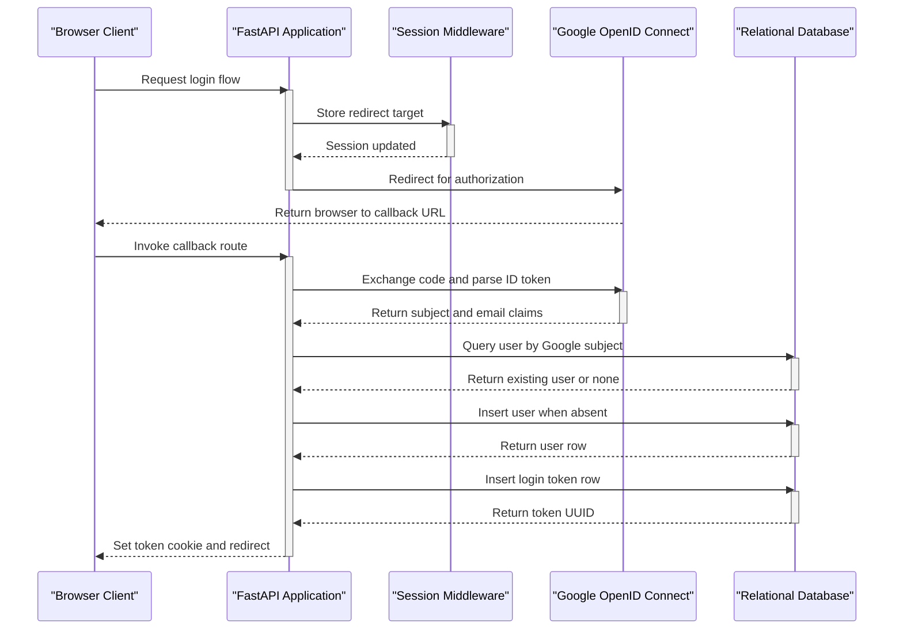
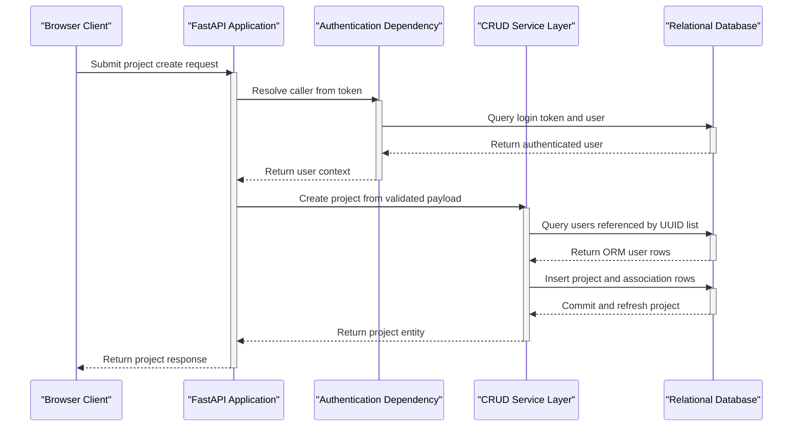
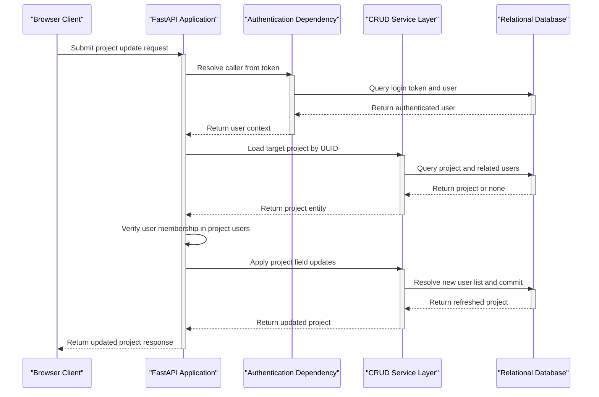

# Low-Level Design — hackbca-example-backend

## Title & Metadata

- Repository: `nikithajoshy26/hackbca-example-backend`
- Repository type: FastAPI backend service
- Last updated: 2026-09-17
- Doc owner: Not determined from repository

## Module/Component Breakdown

### `main.py`

- Responsibility:
  - creates the FastAPI application,
  - registers CORS and session middleware,
  - defines the database dependency,
  - defines the authentication dependency,
  - declares all HTTP routes.
- Public interface:
  - `GET /login/google`
  - `GET /auth/google`
  - `GET /me`
  - `GET /logout`
  - `GET /projects`
  - `GET /projects/{uuid}`
  - `POST /projects`
  - `PUT /projects/{uuid}`
  - `DELETE /projects/{uuid}`
  - `GET /users`

### `crud.py`

- Responsibility:
  - encapsulates direct SQLAlchemy data access for users, login tokens, and projects,
  - resolves project user UUIDs to ORM entities before persistence.
- Public interface:
  - `list_all_projects()`
  - `get_project()`
  - `create_project()`
  - `update_project()`
  - `delete_project()`
  - `list_all_users()`
  - `create_user()`
  - `get_user_by_token()`
  - `get_user_by_subject()`
  - `create_token()`
  - `delete_token()`

### `models.py`

- Responsibility:
  - defines the SQLAlchemy ORM entity model and join table.
- Public interface:
  - `User`
  - `LoginToken`
  - `Project`
  - `xref_table`

### `schemas.py`

- Responsibility:
  - defines Pydantic request and response contracts.
- Public interface:
  - `UserIn`
  - `UserOut`
  - `UserInternal`
  - `User`
  - `LoginTokenIn`
  - `LoginToken`
  - `ProjectIn`
  - `Project`

### `database.py`

- Responsibility:
  - constructs the SQLAlchemy engine, session factory, and declarative base.
- Public interface:
  - `engine`
  - `SessionLocal`
  - `Base`

### `auth.py`

- Responsibility:
  - configures the Authlib OAuth client for Google.
- Public interface:
  - `oauth`

### `settings.py`

- Responsibility:
  - loads environment variables at import time and exposes configuration constants.
- Public interface:
  - `DATABASE_URL`
  - `GOOGLE_CLIENT_ID`
  - `GOOGLE_CLIENT_SECRET`
  - `GOOGLE_REDIRECT_URI`
  - `FRONTEND_URL`
  - `SESSION_SECRET`
  - `TOKEN_NAME`

### `alembic/`

- Responsibility:
  - provides migration environment wiring and the migration template.
- Public interface:
  - `alembic/env.py`
  - `alembic/script.py.mako`
  - migration revisions under `alembic/versions/`

## Key Classes / Functions

| Element | Location | Purpose | Inputs / Outputs | Important Side Effects |
| --- | --- | --- | --- | --- |
| `get_db()` | `main.py` | Provides a request-scoped SQLAlchemy session dependency | Input: none; Output: yielded `SessionLocal()` session | Opens and closes a database session per request |
| `auth()` | `main.py` | Authenticates a caller from cookie or header token | Inputs: cookie token, header token, database session; Output: `User` or `401` | Reads `login_tokens` through `crud.get_user_by_token()` |
| `login_via_google()` | `main.py` | Starts the Google OAuth flow | Inputs: request, optional redirect string; Output: redirect response from Authlib | Stores redirect target in the session cookie |
| `auth_via_google()` | `main.py` | Processes the OAuth callback and creates application login state | Inputs: request, database session; Output: redirect response | Creates users when absent, creates login token row, sets login cookie |
| `create_project()` | `main.py` | Accepts an authenticated project create request | Inputs: `ProjectIn`, database session, authenticated user; Output: `Project` | Persists project row and join-table links |
| `update_project()` | `main.py` | Updates a project after membership authorization | Inputs: project UUID, `ProjectIn`, database session, authenticated user; Output: updated `Project` or HTTP error | Modifies stored project and relationship data |
| `delete_project()` | `crud.py` | Removes a project row | Inputs: database session, project UUID; Output: boolean | Deletes the project and commits the transaction |
| `unpack_project()` | `crud.py` | Resolves incoming project user UUIDs to ORM users | Inputs: database session, `ProjectIn`, optional authenticated user; Output: dictionary of ORM-ready fields | Appends the authenticated user ID when provided |
| `create_token()` | `crud.py` | Creates an application login token for a user | Inputs: database session, user UUID; Output: login token UUID | Inserts a `login_tokens` row and commits |
| `User` | `models.py` | Represents an authenticated person | Input: ORM construction fields; Output: ORM entity | Maintains many-to-many project links and one-to-many login tokens |
| `LoginToken` | `models.py` | Represents a bearer token row tied to a user | Input: user UUID; Output: ORM entity | Persists session-like login state |
| `Project` | `models.py` | Represents a HackBCA project record | Input: project fields; Output: ORM entity | Maintains many-to-many user links |

## Data Models / Schemas

### Database entities

| Entity | Fields visible in repository | Notes |
| --- | --- | --- |
| `users` | `id: UUID`, `email: String`, `google_subject: String` | `email` and `google_subject` are unique in ORM and migration history |
| `login_tokens` | `id: UUID`, `user_id: UUID` | `user_id` references `users.id` |
| `projects` | `id: UUID`, `name: String`, `date_proposed: DateTime`, `time: DateTime`, `type: String`, `description: String`, `github: String`, `url: String` | No non-null constraints are evident in the migrations for most fields |
| `user_project_xref` | `user_id: UUID`, `project_id: UUID` | Composite primary key join table between users and projects |

### Pydantic schemas

| Schema | Fields | Usage |
| --- | --- | --- |
| `UserIn` | `email: str` | Base input shape for user-derived schemas |
| `UserOut` | `email: str`, `id: UUID` | User response payload |
| `UserInternal` | `email: str`, `google_subject: str` | Internal user creation payload after OAuth callback |
| `User` | `email: str`, `id: UUID`, `google_subject: str` | Combined authenticated user shape |
| `LoginTokenIn` | `id: UUID` | Base token schema |
| `LoginToken` | `id: UUID`, `user: UserOut` | Token-with-user response shape |
| `ProjectIn` | `name: str`, `users: List[UUID]`, `date_proposed: datetime`, `time: datetime`, `type: Literal["software", "hardware"]`, `description: Optional[str]`, `github: Optional[str]`, `url: Optional[str]` | Request model for project create and update |
| `Project` | `id: UUID`, plus all `ProjectIn` fields, with `users: List[UserOut]` | Project response payload |

## Sequence Diagrams

### Workflow 1 — Google Login And Local Token Issuance

### Workflow 2 — Authenticated Project Creation

### Workflow 3 — Authorized Project Update

## Error Handling & Retry Behavior

- HTTP errors are raised directly from route handlers using `HTTPException`.
- Explicit behaviors visible in the code:
  - `401` when authentication fails in `auth()`.
  - `403` when an authenticated user attempts to update or delete a project they are not associated with.
  - `404` when a project lookup fails for read, update, or delete routes.
- Database transaction retry logic is not implemented in the repository.
- OAuth retry behavior, backoff, circuit breaking, and dead-letter handling are not determined from repository.
- Validation failures for request bodies rely on FastAPI and Pydantic default behavior.

## Configuration & Environment-Specific Behavior

- `settings.py` calls `load_dotenv()` during import, so local `.env` values are loaded automatically when present.
- `DATABASE_URL` is required for both runtime database access and Alembic migration execution.
- `GOOGLE_CLIENT_ID`, `GOOGLE_CLIENT_SECRET`, and `GOOGLE_REDIRECT_URI` drive the Google OAuth client registration.
- `FRONTEND_URL` defaults to `http://localhost:3000` when unset and is used for:
  - CORS origin configuration,
  - post-login redirects,
  - logout redirects.
- `SESSION_SECRET` defaults to `secret` when unset and is passed to `SessionMiddleware`.
- `TOKEN_NAME` defaults to `hackbca_token` when unset and names both the API key cookie and the API key header.
- Production deployments should replace the default `SESSION_SECRET` with a strong value and verify or explicitly configure hardened settings for the application login token cookie because `main.py` does not pass explicit `Secure`, `HttpOnly`, or `SameSite` arguments when setting that cookie.
- Environment-specific deployment descriptors are not determined from repository.

## Known Limitations / Technical Debt

- All route handlers live in `main.py`; the repository does not separate routers, service orchestration, or dependency modules beyond `crud.py` and `auth.py`.
- `LoginToken` stores only `id` and `user_id`; token expiration or rotation metadata is not modeled.
- Application startup calls `Base.metadata.create_all(bind=engine)` even though Alembic migration scaffolding and revision files are also present, creating two schema-management paths.
- No repository-local tests or checked-in CI workflow definitions were identified during the repository inventory used to generate this document.

## Change Log

- 2026-09-17: Initial repository-grounded LLD created from the FastAPI entrypoint, CRUD layer, ORM models, Pydantic schemas, settings module, Authlib configuration, and Alembic files. Added all LLD sections because `docs/LLD.md` did not previously exist.
