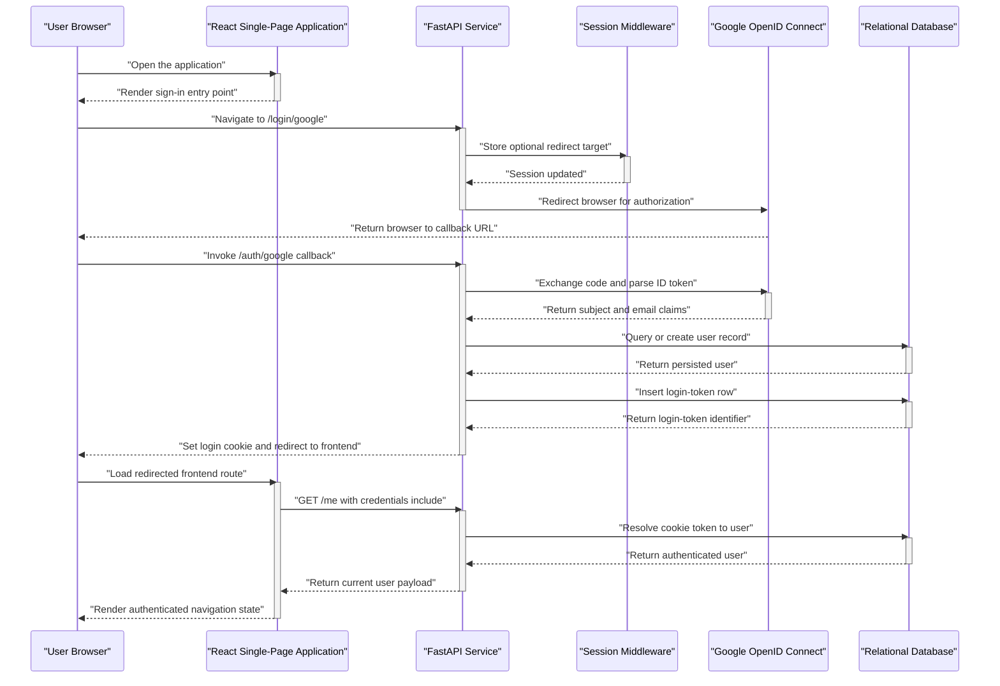
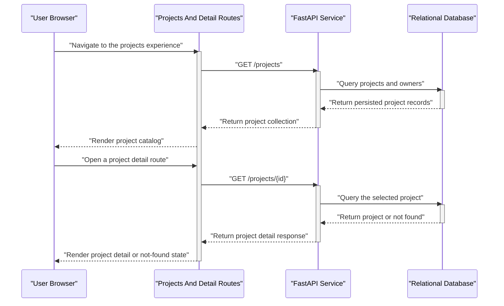
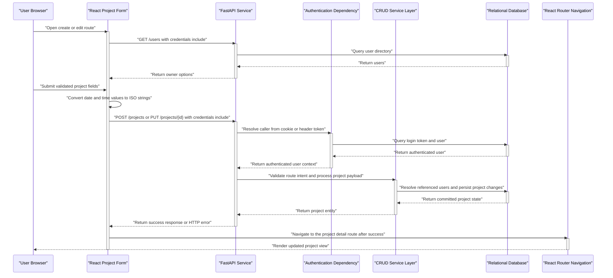

# Low-Level Design — hackBCA Example System

## Title & Metadata

- Consolidation target repository: `nikithajoshy26/hackbca-example-backend`
- Document type: Consolidated low-level design
- Last updated: 2026-09-17
- Doc owner: Not determined from component docs
- Source scope: Consolidated from both component HLD and LLD inputs to describe cross-component low-level behavior
- Component repos merged:
  - Frontend — `nikithajoshy26/hackbca-example-frontend` (`docs/HLD.md` last updated 2026-09-17; `docs/LLD.md` last updated 2026-09-17)
  - Backend — `nikithajoshy26/hackbca-example-backend` (`docs/HLD.md` last updated 2026-09-17; `docs/LLD.md` last updated 2026-09-17)

## Module/Component Breakdown

### Frontend

- **Application shell and routing**
  - `App` initializes authentication state from `/me` and maps browser routes to page components.
  - `Navbar` and `Footer` provide persistent page chrome around routed views.
- **User-facing pages**
  - `Home` renders the landing page and sign-in prompt.
  - `Projects` renders the project collection and deletion flow.
  - `Project` renders one project detail view.
  - `NewProjectForm` and `UpdateProjectForm` handle create and edit workflows.
- **Supporting client utilities**
  - `getAPIURL()` resolves the backend base URL.
  - Formatting, type, modal, and CSS modules support presentation and form behavior.

### Backend

- **HTTP entrypoint and dependencies**
  - `main.py` creates the FastAPI app, middleware, dependencies, and route handlers.
- **Persistence layer**
  - `crud.py` encapsulates data access for users, login tokens, and projects.
  - `models.py` defines ORM entities and the project-user join table.
  - `database.py` constructs the engine, session factory, and declarative base.
- **Schema and configuration layer**
  - `schemas.py` defines request and response contracts.
  - `settings.py` loads environment configuration constants.
  - `auth.py` registers the Google OAuth client.
- **Schema-management support**
  - `alembic/` provides migration environment wiring and revision support.

### Cross-Cutting

- The frontend depends on backend routes for authentication state, user-directory loading, project reads, and project mutations.
- The frontend `Project` and `User` shapes correspond to backend response models for the same entities, so changes to backend API contracts affect frontend routing, rendering, and form submission behavior.

## Key Classes / Functions

| Element | Component | Purpose | Inputs / Outputs | Important Side Effects |
| --- | --- | --- | --- | --- |
| `App` | Frontend | Bootstraps routing and authentication state | Output: application shell and shared auth context | Requests `GET /me` and updates frontend auth state |
| `Navbar` | Frontend | Builds login, logout, and route navigation | Inputs: current route and auth state; Output: navigation UI | Emits backend login and logout links |
| `Projects` | Frontend | Lists projects and coordinates deletion | Output: project-grid UI | Requests `GET /projects`; issues `DELETE /projects/{id}` |
| `Project` | Frontend | Loads and renders one project | Input: route project id; Output: project-detail UI | Requests `GET /projects/{id}` |
| `ProjectFormContent` | Frontend | Hosts shared create and update form logic | Inputs: form state, current user, update mode; Output: project mutation requests | Requests `GET /users`; issues `POST /projects` or `PUT /projects/{id}`; navigates after success |
| `prepareInput` | Frontend | Converts form values into backend payload shape | Inputs: raw form values and current user; Output: API-ready payload | Creates ISO date/time strings and appends the current user id |
| `getAPIURL` | Frontend | Resolves the backend base URL | Input: environment configuration; Output: base URL string | Selects deployed or localhost backend target |
| `get_db()` | Backend | Provides a request-scoped database session dependency | Output: SQLAlchemy session | Opens and closes a database session per request |
| `auth()` | Backend | Authenticates a caller from cookie or header token | Inputs: token plus database session; Output: authenticated user or `401` | Reads login-token state from persistence |
| `login_via_google()` | Backend | Starts the Google OAuth flow | Inputs: request and optional redirect; Output: redirect response | Stores redirect state in the session |
| `auth_via_google()` | Backend | Processes the OAuth callback and establishes application login state | Inputs: request and database session; Output: redirect response | Creates users when absent, creates login-token rows, and sets the login cookie |
| `create_project()` | Backend | Accepts authenticated project-creation requests | Inputs: validated project payload, database session, authenticated user; Output: persisted project | Persists project and project-user association rows |
| `update_project()` | Backend | Updates a project after authorization checks | Inputs: project id, validated payload, database session, authenticated user; Output: updated project or HTTP error | Modifies project fields and membership associations |
| `delete_project()` | Backend | Removes a project row in the CRUD layer | Inputs: database session and project id; Output: boolean success flag returned to the route layer | Deletes the project and commits the transaction |
| `unpack_project()` | Backend | Resolves incoming project user ids into persistence-ready data | Inputs: database session, project payload, optional authenticated user; Output: ORM-ready field dictionary | Appends the authenticated user id when provided |
| `create_token()` | Backend | Creates an application login token for a user | Inputs: database session and user id; Output: login-token id | Inserts and commits a login-token row |
| `User`, `LoginToken`, `Project` | Backend | Represent persisted users, bearer tokens, and project records | Inputs: ORM construction fields; Output: ORM entities | Maintain project memberships and token ownership relationships |

## Data Models / Schemas

| Model / Schema | Component | Key Fields | Relationship To Other Component |
| --- | --- | --- | --- |
| `User` response shape | Frontend | `id`, `email` | Mirrors the backend user response fields used for owner lists, ownership checks, and authenticated-user rendering |
| `Project` response shape | Frontend | `name`, `users`, `date_proposed`, `time`, `description`, `github`, `url`, `type` | Mirrors the backend project payload that powers listing, detail, and edit flows |
| Project mutation payload | Frontend | `name`, `users`, `date_proposed`, `time`, `type`, optional `description`, `github`, `url` | Serialized into the same logical fields the backend accepts for create and update requests |
| `users` table / entity | Backend | `id`, `email`, `google_subject` | Provides the persistent source of truth for frontend user displays and project-owner selection |
| `login_tokens` table / entity | Backend | `id`, `user_id` | Backs the authenticated state the frontend later observes via `/me` |
| `projects` table / entity | Backend | `id`, `name`, `date_proposed`, `time`, `type`, `description`, `github`, `url` | Provides the persistent source of truth for frontend project list and detail rendering |
| `user_project_xref` join table | Backend | `user_id`, `project_id` | Supplies the owner associations displayed and edited from the frontend |
| Backend Pydantic `UserOut` and `User` | Backend | User identifiers and email fields, with `google_subject` in the internal/authenticated shape | Correspond to the frontend user object fields, with backend-only identity details remaining server-side |
| Backend Pydantic `ProjectIn` and `Project` | Backend | Project fields plus owner collections | Represent the server contract that the frontend form and project views consume |

- The frontend docs describe the browser-side `User` and `Project` objects as API-consumed shapes rather than independent persisted models.
- The backend docs identify the relational tables and Pydantic schemas as the persistence and API contract sources of truth.

## Sequence Diagrams

### Workflow 1 — Google Login, Backend Token Issuance, And Frontend `/me` Bootstrap

### Workflow 2 — End-to-End Project Discovery And Detail Rendering

### Workflow 3 — Authenticated Project Creation And Update From React Form To Database

## Error Handling & Retry Behavior

| Area | Frontend Behavior | Backend Behavior | Retry Behavior |
| --- | --- | --- | --- |
| Authentication bootstrap | `/me` lookup initializes auth state without documented client retry logic | Auth dependency returns `401` when token resolution fails | No explicit retry logic in either component doc |
| Project listing and detail loading | Project-list and project-detail routes surface fetch failures in UI state; the detail route maps `404` and `422` to a not-found outcome | Read routes return serialized data or `404` when a project is missing | No explicit retry logic in either component doc |
| User-directory loading for forms | Form state stores an error and changes dropdown behavior when `GET /users` fails | User-list endpoint supplies the owner directory used by the form | No explicit retry logic in either component doc |
| Project create and update | Form submission sets a generic description-field error on non-success responses | Authenticated write routes raise `401`, `403`, or `404` as applicable and rely on request validation defaults for payload failures | No explicit retry logic, backoff, or rollback behavior is documented |
| Project deletion | Frontend deletion removes the row from local state after issuing `DELETE /projects/{id}` | Delete route verifies authorization and removes the persisted project row | No explicit retry logic or reconciliation flow is documented |
| OAuth login | Frontend relies on browser navigation rather than in-app retries | Backend delegates to Google OAuth and then creates application login state | OAuth retry, backoff, and circuit-breaking behavior are not determined from the component docs |

## Configuration & Environment-Specific Behavior

### Frontend

- `REACT_APP_API_URL` selects the backend base URL and otherwise falls back to `http://localhost:8000`.
- Different production backend targets require either distinct frontend builds or an external runtime-injection strategy not described in the component docs.
- Client-side routing requires SPA-friendly hosting that rewrites deep links back to the frontend entry point.

### Backend

- `DATABASE_URL` configures runtime database access and migration execution.
- `GOOGLE_CLIENT_ID`, `GOOGLE_CLIENT_SECRET`, and `GOOGLE_REDIRECT_URI` configure the Google OAuth client.
- `FRONTEND_URL` configures redirect behavior and browser-origin policy.
- `SESSION_SECRET` and `TOKEN_NAME` configure session signing and login-token transport naming.

### Cross-component behavior

- Successful login and logout flows require the frontend and backend to agree on the reachable frontend URL and backend API base URL.
- Authenticated browser calls depend on environment-specific cookie behavior because the frontend sends credentials and the backend issues the login token.

## Known Limitations / Technical Debt

- The frontend docs identify optimistic deletion behavior, non-ideal `useEffect(async () => { ... })` usage, and JavaScript-only executable code despite separate type declarations.
- The backend docs identify a compact structure with all route handlers in `main.py`, no token-expiration metadata in `LoginToken`, and two schema-management paths (`create_all` plus Alembic).
- Both component docs leave important operational details undetermined, including retry strategies, production logging, retention policy, and several deployment hardening decisions.
- Contract coupling exists between frontend API-consumed shapes and backend response models, so undocumented backend contract changes can ripple into frontend routing, ownership checks, and project form behavior.

## Change Log

- 2026-09-17: Consolidated `nikithajoshy26/hackbca-example-frontend` (`docs/HLD.md` last updated 2026-09-17; `docs/LLD.md` last updated 2026-09-17) and `nikithajoshy26/hackbca-example-backend` (`docs/HLD.md` last updated 2026-09-17; `docs/LLD.md` last updated 2026-09-17) into this unified system LLD.
